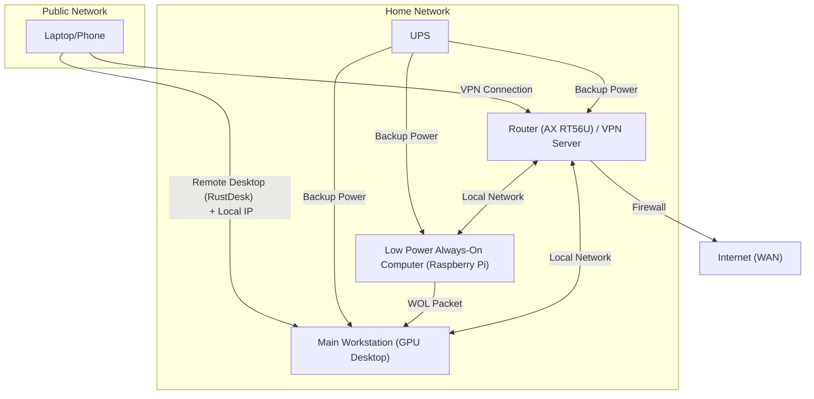

Ever wanted to access your powerful home workstation while you're away? In this guide, I'll show you how I transformed my gaming desktop into a secure, remotely accessible homelab for AI and data science work. No enterprise budget required—just some clever configuration and open-source tools.

The following section will describe how I turn my existing workstation desktop into a homelab for addressing the need of myself. I hope that this will help to inspire or provide some guidance if you are also some one who seek to turn your hardware into a server like for experiment.

## Project Motivation

Recently, I have set up my very own Workstation Desktop at my home. While it is not top of the line hardware it have a reasonable RTX 4080 Super with 16GB VRAM and a 32 GB of RAM DDR5 and a AMD 7900X3D which open up whole realm of possible models that I can test and research on. But this advantage very much end the moment I walk out of my house and on a remote location.

In theory, I could just use free cloud service like Google Colab or Kaggle while I am away. But having to alway set up your environment while also taking cloud computing budget have been the a huge hassle to say the least of my learning journey. Additionally, I only want to use cloud computing when it come to Large Language Model (LLM) or for training Transformer architect. Most deep learning tasks are more than capable of being fullfil on the local hardware that I possesed. In addition, it also allow for more secure management of private data that is not appropriate to be host by any third-party cloud server.

Thus, that where the concept of Home Lab come to play. Home lab referreing to the act of turning any computer system that you possess into a server like environment where you could safely experiment with computer and program alikes. The ideas have been floating around the internet for a while and there are many community and practional around the world. These community include both hobbyist, researcher as well as professional around world thus you know you can learn alot from many people with different backgrounds.

## Project Goal

Now, I am a firm believer that in order for any project to be success you will need concrete goals. This is to help manage expectation and to ensure that it is achiveable. Especially in the world of computer hardware where there are million of options to choose from an some are not very realistic for regular everyday users.

In addition, we will also need to taking into account of limitation that will be face by many regular user without the budget of a corporation or business on hands. However if you have a budget of a business this guide likely is not appropriate for you to look at

Our goals and limitation are:

1. **Secure access**: Our system should be secure to prevent any malicious party from taking advantage of it during our usage. However, it is not fully fire proof with hardware redundancy or multi-layer firewall and hardware isolation since this is too complex and expensive for one person to maintain.

2. **Reliable access**: Our system should be reliable against simple power outage, connection issues. This only taking into account of simple 3-4 hours outage or drop out and not for full days outage. Connection should also be as reliable as possible from existing commercial network as it not possible to extablish hardline network from site to site.

3. **Low maintaince**: It should be low involvement as much as possible while keeping our first and second goals. But since we are the one building it, the maintain responsiblity will still be on us to keep it up and running. Thus, we would want to stick to open source or community backup project or standard hardware to ensure that when something go wrong we can gain some insight into how to fix it.

4. **Low budget**: Finally it should be low cost to invest and to maintain the system. But for certain hardware and security features, we will still spend within reasonable amount to ensure previous goals are met. How much is reasonable will need to be determine by yourself but for my case anything more than 100-200 USD per years is way to much.

## Hardware & Software Requirement

Unfortunately the reality is in the daily consumer hardware is not comparable to similar level of reliablity as business or enterprise hardware. But the bare minimum we will need are:

1. **Router / Modem**: Preferably something that you have full control over and not from your Internet Provider (IP). I have a ASUS AX6000 RT-AX88U from Asus which I purchase myself few years ago and it does just that.

2. **A low power always on computer**: A Raberry Pi 4 or 5 or any low power computer that is constantly running on low wattage. We will need this for our to wake up our main computer with GPU using Wake-on-Lan (WOL). We also want to use it to set up a Virtual Private Network (VPN) server function for a secure way to access our home network.

3. **A powerful computer with GPU**: This will be you main system where you run all your experiments on. For OS it ok to use something like Window for your daily use case. If you feel adventurous you can also install Linux for a full terminal like experient like a regular cloud server. Your mother board should also ideally support WOL magic package.

4. **An Uninteruptable Power Supply (UPS)**: This is use to ensure that if the power go out your system does not just come crashing down. It should connect to everything above this list.

> **Tips**:
> Certain router model like the AX RT56U from Asus come with support to VPN server function build it along side ability to send WOL magic package. Change are if you purchase a router to use as an alternative to your modem from your IP provider there is good chance it support the function for requirement 1 and 2. Thus, do double check your hardware specs and save yourself some money.

> **Note**: For UPS unfortunately you can't just simply use any UPS. You will need to calculate your Workstation + Router + Mini Server Wattage not VA or anything plug into with an additional 30-40 % overhead power before you decide to purchase your UPS. UPS with true sine would be best for computer but simulated sine will works just fine since we only need the computer to run for a short perioud before switch off. Think of them as your computer insurance policy and budget accordingly. How much do you willing to spends before having to fix your computer.

For software, we will need some management program to ensure you are capable of controlling your system securely.

1. **A VPN Server Protocol**: WireGuard or OpenVPN are two of the most popular choice when it come to self host VPN server. WireGuard is slighly newer thus support higher speed choose this if your have the choice or your hardware support it. Alternatively, you can also use Tailscale. Despite it being the youngest it also boast to be the simplest way to set up a VPN networks on this list. For this I highly recommend Tailscale as it is free for personal use and is much easier to set up that the previous two protocol.

2. **A power management program**: This is something that usually come with more intermediate UPS for desktop. It purpose is to detect when the powerswitch happened and shut your Desktop down gracefully when the batter is low. This ensure your hardware don't get damage during sudden power down.

3. **A remote desktop application**: A way for you to control your desktop remotely as if you are directly in front of it. For this case we will be using RustDesk as it is a open source program with good feature sets.

If you are an experience network engineer you will likely notice I am not including a IP KVM in the list mainly as this will add on additional cost. If you are not familiar with what a IP KVM is, it basically is a small computer that capable of capture your main desktop (server) video output, provide physical input like keyboard mouse and physicall power management throught direct board access. It a very powerful devices use in enterprise server to ensure you can access and manage these device without having to physically in the same spaces.

Now adays it possible to make a DIY PiKVM or purchase commercial one like JetKVM or GL.inet Comet. This will add on the benefit of physical button press to reset your system in case it OS get lock up but for my use case I rarely find the need for it yet thus I decide to skip it for now. But if you have one you can skips the second and third requirement for software.

## Architect & Workflow Design

The ideas is fairly straight forward with program like RustDesk we can establish and control the workstation with our laptop as if we are directly at home. However typically this required us to be on the same network as our home. We going to overcome it using our good old friend VPN server.

## Step 1: Set up our VPN Server

First we will need a VPN server. Typical VPN can be categorise as either client or server. Most VPN service you can subcribe to like NordVPN, Microsoft VPN are what call a client VPN. Your connection is router thought these company dedicate Virtual Private Server (VPS) which sit at a computer centers somewhere around the world before going out to the internet. These VPS act as a VPN server that will masked your device IP to different location and communication is then encrypted for your privacy.

VPN server can typically be host for free given that you have a dedicate low power alway on computer or a router that can support this functions. This essentially route your traffic from your current public wifi throught your home network prior to move it to the internet. Thus any communication is secure by your home network firewall and encryption rules.

This is what we want as we don't want everyone on the network we connect on public to be able to see fully what we are doing at our home network and potentially hijack our connection. Typically this required a dedicate knowledge on port-forwarding, setting up tunnel, config VPN profile, CGNAT but we will skip most of this by using something call a Tailscale. The ideas is pretty stratight forward, Tailscale use a mesh network base on WireGuard protocol with the encryption for the network is directly link to your identity provider (Google, Apple ID, User accounts). 

When you connect throught the network it take care of the port-forwarding, network punching and then add your devices as a nodes with a dedicate Tailscale IP in this mesh networks. All communication is encrypt within this networks and you have full control over how it is communicate with each others. Thus, I will be using Tailscale as a simple way to set up my VPN connection with all the devices within my home networks.

Now in practice you can mix different VPN services to help isolate certain part of your connection network for slightly more secure way to connect. In fact this was what I did, where some connection in my network is establish using OpenVPN protocol and some using Tailscale. But this will require some networking vodoo which I feel like derserving it own posts. For now I will link you to this very usefull guide on how to set up your own VPN server.

> **Tips**:
> For VPN server you will need something call a Public IP address. There is also the concept of Static IP address which is just a Public IP address that does not change when your network provider reset every now and then (Or know as a Dynamic IP). You can check it by searching your IP online but the best way to make sure is just call your IP provider. Typically they will be happy to do this for you for free.

> **Tips**: Some VPN service will require you to use Static IP for best results but in reality you can just use a Public IP with a DDNS (Dynamic Domain Naming Services) to help keep track of you ever changing IP. A fair amount of this service is offer for a small fee, or in my case (an Asus router) for free when you purchase their hardware. So before going out to buy a DDNS service do check if your router already have this function.

## Step 2: Setting Up Wake-on-LAN (WOL)

[Instructions for configuring WOL on the main workstation]

While keeping my workstation 24/7 is a good alternative, it is also an expensive ideas. Most consumer level hardware do not often stress test their hardware against continous wear and tear to the standard of their business counter part. This mean it is not a good ideas to keep your system running constantly as it reduce the hardware lifetime as well as increasing your electric bill needlessly. Thus, it a good ideas to set it a low-power stage and wake it up when you need using WOL.

Now most commercial motherboard nowadays often come with WOL capabilities. But this come with a caviar, your computer must not be physically power off. If you are running any modern Window OS this is typically not an issues as since Window 10 most computer shutdown into what is knowed as soft-stage shutdown. When user use the shut down command (not the the physical power off button on your desktop), your computer actually go into a hypernation with certain element on it motherboards still running. This allow the computer to preload certain component and it it much faster to turn itself back on when you turn it up.

> **Tips**: Only a IP KVM with a direct connection to your power button mini board or a server class motherboard can truly power off, hard reset or turn on system as if you are pressing a physical button remotely. You can DIY this slightly cheaper using smart wifi board module from Tuya or smart home to have similar functionality over smart home systems. Just ensure you are using reputable brand options as there are case of them bricking machine unintentionally (as it can turn off power completely).

There are a few setting you will have to check or turn on to make this works:

1. Window System WOL services (off by default)
2. Your Motherboard BIOS WOL setting (on by default)
3. Network rules to indicate which devices WOL magic package is accepted (off by default)

## Step 3: Configuring Remote Desktop with RustDesk

[Step-by-step RustDesk setup and configuration]

## Step 4: UPS Configuration and Power Management

[UPS setup and automatic shutdown configuration]

## Step 5: Testing and Troubleshooting

[Common issues and how to resolve them]

### I can't seem to wake up my Workstation

Make sure you check off all item on Step 2. Any of the item is missing would likely cause you workstation to not receive the WOL magic packages.

### How to know if my IP give me a public IP or not?

Call your IP provider first, it usually the quickest and the most guarantee way.

### How to make my remote exprience smoother?

Usually the desktop smoothness usually come with internet speeds and capture protocol. But typically you should expect somewhere between 100-150 mbps connection with fairly low Ping. If it lower speed or higher Ping, do check to ensure you are not behind double VPN (your school or work might have they own VPN service). If you are try to use 4G/5G LTE for you connection or physically connect to your school network to see if this improve.

## Security Considerations

[Additional security measures and best practices]

### Whitelist IP devices you will use to access

Only allow certain devices in the IP network to remote into your desktop. This prevent any chance of malicious party from gain access. 

### Do not turn off your Firewall rules

Some guide online will suggest turn off firewall on certain port to make the experience smoother. This is a great one way trip to your home network being take over.

### 2FA Authentication

Use 2FA Authentication during access alognside your password will help to make it more secure. Please use the 2FA app option since 2FA using SMS is currently not the most secure manner to gain access.

### Separate admin and daily account on workstation.

Separate your admin and daily account on your workstation. You want to create a separate "Standard User" account from the one your "Default User" account (which create automatically when turn on computer first time) as it have admin right on your computers. When remote in use the Standard User account to work on and use the password from Default User to verify setting or installation. This is recommend regardless of if you are using remote desktop or not.

### Create a habit of log reviewing

## Conclusion

[Summary and next steps]

